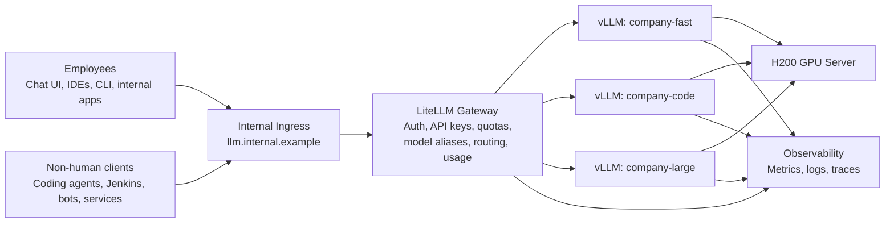

# On-Prem LLM Platform HLD

A high-level reference architecture for serving internal LLM workloads from an on-prem GPU server, using Kubernetes, LiteLLM, vLLM, Jenkins, and a basic observability stack.

The scenario assumes:

- One or more NVIDIA GPU servers, for example an H200 server
- Internal users need chat, coding assistance, and API access
- Some workloads are human-driven
- Some workloads are non-human, such as coding agents, CI jobs, bots, and backend services
- The platform should include quotas, staging, benchmarking, monitoring, logging, and basic tracing
- Version 1 should stay simple and use vLLM as the model-serving backend

## Core architecture



## First-version component list

| Area | Component | Purpose |
|---|---|---|
| LLM gateway | LiteLLM | One internal OpenAI-compatible API surface, auth, quotas, routing, usage tracking |
| Model serving | vLLM | Load and serve LLMs on GPU |
| Runtime | Kubernetes | Deployment, isolation, rollout control, staging/prod separation |
| GPU stack | NVIDIA GPU Operator | Kubernetes GPU drivers, device plugin, DCGM metrics |
| CI/CD | Jenkins | Deploy candidates to staging, run benchmarks, promote to production |
| Metrics | Prometheus | Scrape and store metrics |
| Dashboards | Grafana | Dashboards for platform, model, and GPU health |
| Logs | Loki + Alloy/Promtail | Centralized logs |
| Tracing | OpenTelemetry Collector + Tempo or Jaeger | Request flow tracing and latency breakdown |
| Chat UI | Open WebUI or LibreChat | Internal chat interface |
| Coding tools | Continue, Aider, OpenHands, compatible CLI agents | Developer-facing coding workflows |

## Stable API design

Expose one stable internal endpoint:

```text
https://llm.internal.example/v1
```

Main endpoint:

```text
POST /v1/chat/completions
```

Clients select a model alias in the request:

```json
{
  "model": "company-code",
  "messages": [
    { "role": "user", "content": "Explain this function" }
  ]
}
```

Do not expose vLLM directly to users or tools. vLLM should stay private inside the cluster.

## Recommended docs

- [Architecture](docs/architecture.md)
- [Kubernetes layout](docs/kubernetes.md)
- [Quotas and identity](docs/quotas-and-identity.md)
- [Observability and tracing](docs/observability.md)
- [Staging, benchmarks, and coding-agent evals](docs/staging-and-evals.md)
- [Frontend and coding-agent options](docs/frontend-and-agents.md)
- [Operational notes](docs/operations.md)

## Design stance

Version 1 should avoid unnecessary complexity.

Use:

```text
LiteLLM -> vLLM -> H200
```

Do not start with a heavier optimized inference stack unless benchmarks prove it is needed.
