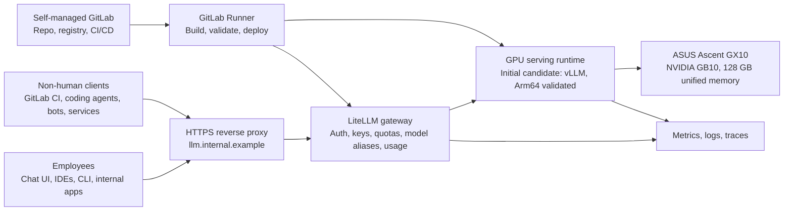

# GX10 Local LLM Serving HLD

A high-level design for serving internal LLM workloads from one **ASUS Ascent GX10** AI workstation, using an on-prem GitLab instance, LiteLLM, a GPU-backed serving runtime, Docker Compose, and lightweight observability.

This design deliberately replaces the earlier H200, Kubernetes, and Jenkins assumptions.

## Scope and assumptions

The initial host is one GX10 with:

- NVIDIA GB10 Grace Blackwell platform
- Arm64 Linux environment
- 128 GB unified memory
- 1 TB NVMe storage
- 10 GbE networking

The design assumes internal users need chat, coding assistance, and API access, while non-human clients include coding agents, GitLab CI jobs, bots, and internal services.

Before implementation, validate that the selected serving runtime, container images, model architecture, CUDA stack, and required developer tools support **Linux Arm64 on the GX10**. The API and deployment structure should remain usable even if the preferred runtime changes.

## Design stance

Version 1 is a **single-host platform**, not a cluster.

Use:

```text
Internal clients -> HTTPS reverse proxy -> LiteLLM -> GPU serving runtime -> GX10
```

Use Docker Compose for deployment. Do not introduce Kubernetes or a distributed inference stack until the single-host design has a demonstrated limitation.

A single GX10 does not provide high availability, true environment isolation, or capacity for production and GPU-heavy staging workloads at the same time. Staging is therefore a controlled candidate deployment or benchmark window on the same host, not a separate production-equivalent environment.

## Core architecture


```mermaid
flowchart LR
    people["Employees\nChat UI, IDEs, CLI, internal apps"] --> proxy["HTTPS reverse proxy\nllm.internal.example"]
    automation["Non-human clients\nGitLab CI, coding agents, bots, services"] --> proxy

    proxy --> gateway["LiteLLM gateway\nAuth, keys, quotas, model aliases, usage"]
    gateway --> runtime["GPU serving runtime\nInitial candidate: vLLM, Arm64 validated"]
    runtime --> gx10["ASUS Ascent GX10\nNVIDIA GB10, 128 GB unified memory"]

    gateway --> telemetry["Metrics, logs, traces"]
    runtime --> telemetry

    gitlab["Self-managed GitLab\nRepo, registry, CI/CD"] --> runner["GitLab Runner\nBuild, validate, deploy"]
    runner --> gateway
    runner --> runtime
```

## First-version component list

| Area | Component | Purpose |
|---|---|---|
| Host | ASUS Ascent GX10 | Single Arm64 GPU-serving host |
| Runtime | Docker Engine + Docker Compose | Reproducible single-host deployment |
| LLM gateway | LiteLLM | One OpenAI-compatible API, identity, quotas, routing, and usage tracking |
| Model serving | GPU serving runtime | Load and serve models. Start with vLLM only after GX10 compatibility validation. |
| Edge | Caddy, NGINX, or equivalent | Internal TLS, request limits, and a single public internal route |
| Source control and CI/CD | Self-managed GitLab + GitLab Runner | Source control, container registry, pipeline validation, controlled deployment |
| Metrics | Prometheus + Grafana | Service, host, and GPU health |
| Logs | Container logs, optionally Loki + Alloy | Operational logs and troubleshooting |
| Tracing | OpenTelemetry, optional in V1 | Latency breakdown when needed |
| Chat UI | Open WebUI or LibreChat | Internal interactive interface |
| Coding tools | Continue, Aider, OpenHands, compatible CLI agents | Developer-facing workflows |

## Stable API design

Expose one stable internal endpoint:

```text
https://llm.internal.example/v1
```

Main endpoint:

```text
POST /v1/chat/completions
```

Clients select a model alias in the request:

```json
{
  "model": "company-code",
  "messages": [
    { "role": "user", "content": "Explain this function" }
  ]
}
```

Do not expose the serving runtime directly to users or tools. Only LiteLLM should be reachable through the internal reverse proxy.

## Model aliases

Aliases allow model replacement without changing client configuration:

```text
company-fast
company-code
company-large
company-candidate
```

An alias is a product contract, not a guarantee that every named model can run concurrently on one GX10. Capacity and latency must be benchmarked before enabling an alias for broad use.

## Recommended documents

- [Architecture](docs/architecture.md)
- [Single-host deployment](docs/deployment.md)
- [GitLab CI/CD](docs/gitlab-ci-cd.md)
- [Quotas and identity](docs/quotas-and-identity.md)

## Non-goals for version 1

- Kubernetes
- Multi-node or multi-GX10 serving
- High availability or automatic failover
- Running production and GPU-heavy staging workloads simultaneously
- Direct public internet exposure
- A custom inference gateway or custom scheduler
