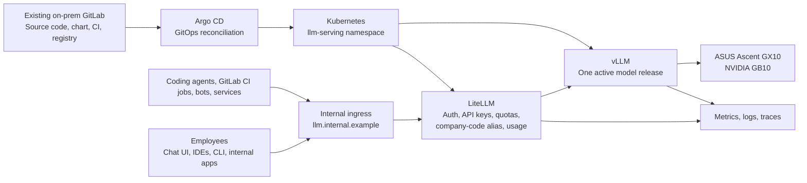

# GX10 On-Prem LLM Platform HLD

## v0.1.0

A GitOps design and repository scaffold for serving internal LLM workloads from one ASUS Ascent GX10 using Kubernetes, LiteLLM, vLLM, Helm, Argo CD, the existing on-prem GitLab, and basic observability.

## v0.1.0 operating model

```text
One GX10
One Kubernetes namespace: llm-serving
One active vLLM base model
One stable internal API endpoint
One Helm release
Git is the desired state
Argo CD reconciles Git to Kubernetes
```

The service is an internal capability alongside existing subscriptions. Model changes may cause a planned interruption while the new model loads. A Git revert is the normal rollback path.

## Why one active model

Version 0.1.0 deliberately serves one GPU-backed base model at a time. It does not require GPU time-slicing, CUDA MPS, MIG, or a permanently active staging model.

This keeps the single-GX10 service predictable and easier to operate: the active model has the full GPU, there is no multi-model resource contention to manage, and production behavior is simpler to benchmark, observe, secure, and troubleshoot. The trade-off is accepted because planned interruption during model evaluation or rollback is acceptable for this internal service.

New models are tested by replacing the active model through the GitOps workflow. The stable LiteLLM endpoint and `company-code` alias remain unchanged. A Git revert restores the previous known-good model release.

See [ADR-0001: One Active vLLM Model for v0.1.0](docs/decisions/0001-v0.1.0-one-active-model.md) for the full decision and revisit conditions.

## Repository scaffold

The branch includes a Helm chart, tracked GX10 values, a validation-only GitLab CI file, an Argo CD Application bootstrap template, local validation and smoke-test scripts, and operator documentation.

Nothing in this repository has been deployed. Before the first intentional deployment, replace the placeholder image digests and model revision in `charts/llm-serving/values/gx10.yaml`, create the real external Secret, validate a GX10-compatible Kubernetes GPU resource path, and bootstrap the Argo CD Application with the existing internal GitLab repository URL.

## Core architecture


```mermaid
flowchart LR
    users["Employees\nChat UI, IDEs, CLI, internal apps"] --> ingress["Internal ingress\nllm.internal.example"]
    automation["Coding agents, GitLab CI jobs, bots, services"] --> ingress

    ingress --> litellm["LiteLLM\nAuth, API keys, quotas,\ncompany-code alias, usage"]
    litellm --> vllm["vLLM\nOne active model release"]
    vllm --> gx10["ASUS Ascent GX10\nNVIDIA GB10"]

    gitlab["Existing on-prem GitLab\nSource code, chart, CI, registry"] --> argocd["Argo CD\nGitOps reconciliation"]
    argocd --> cluster["Kubernetes\nllm-serving namespace"]
    cluster --> litellm
    cluster --> vllm

    litellm --> obs["Metrics, logs, traces"]
    vllm --> obs
```

## Responsibilities

| Area | Component | Responsibility |
|---|---|---|
| Source of truth | Git repository in the existing GitLab | Helm chart, environment values, model release definition, deployment history |
| CI | Existing GitLab CI and runners | Validate chart changes; build and publish an immutable image only when custom deployment code changes |
| CD / GitOps | Argo CD | Render the Helm chart and reconcile the Git revision into Kubernetes |
| Runtime | Kubernetes | Run LiteLLM and one GPU-backed vLLM deployment |
| LLM gateway | LiteLLM | Stable OpenAI-compatible API, identity, quotas, routing, usage |
| Model serving | vLLM | Load and serve the active model on the GX10 |
| GPU integration | Validated GX10 driver, container runtime, and device-plugin path | Expose `nvidia.com/gpu: 1` to Kubernetes before application deployment |
| Observability | Prometheus, Grafana, logs, optional tracing | Service and host visibility |

GitLab CI does not run direct `helm upgrade` commands against the cluster in this design. Argo CD is the only application deployer.

## Stable API

```text
https://llm.internal.example/v1
POST /v1/chat/completions
```

Clients use a stable alias:

```json
{
  "model": "company-code",
  "messages": [
    { "role": "user", "content": "Explain this function" }
  ]
}
```

A model replacement changes the pinned release behind `company-code`; clients keep the same endpoint and alias.

## Model release workflow

```text
Change model release values in Git
→ GitLab CI validates the chart and rendered manifests
→ merge the approved change
→ Argo CD synchronizes the Helm release
→ Kubernetes replaces the active vLLM pod
→ smoke test and user evaluation
→ retain the commit or revert it
```

The active vLLM Deployment uses `Recreate` so the previous GPU-serving pod stops before the replacement starts.

## Versioning

- Helm chart version: `0.1.0`
- Deployment package app version: `0.1.0`
- vLLM image: immutable digest
- Model: exact repository revision and quantization settings in Git

The chart version changes when templates or chart behavior change. A model-only change updates the GX10 values file and keeps the chart version unchanged.

## Documents

- [Implementation overview](docs/implementation.md)
- [Acceptance checklist](docs/acceptance-checklist.md)
- [Bootstrap runbook](docs/bootstrap.md)
- [Compatibility and upgrades](docs/compatibility-and-upgrades.md)
- [Kubernetes distribution](docs/kubernetes-distribution.md)
- [Secret handling](docs/secrets.md)
- [Model release workflow](docs/model-release.md)
- [Architecture](docs/architecture.md)
- [Kubernetes layout](docs/kubernetes.md)
- [GitOps v0.1.0](docs/gitops.md)
- [ADR-0001: One Active vLLM Model](docs/decisions/0001-v0.1.0-one-active-model.md)
- [ADR-0002: K3s and GPU Operator](docs/decisions/0002-k3s-and-gpu-operator.md)
- [GitLab CI/CD](docs/gitlab-ci-cd.md)
- [Quotas and identity](docs/quotas-and-identity.md)
