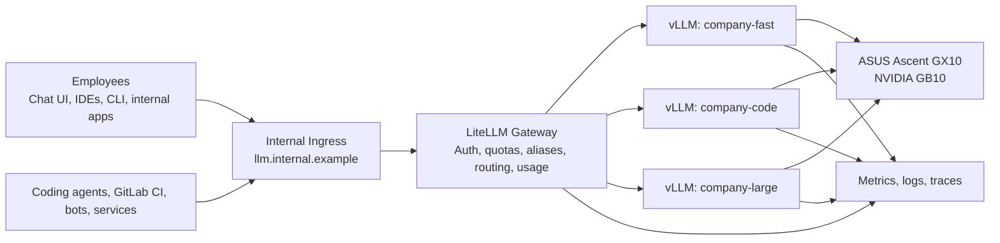

# GX10 On-Prem LLM Platform HLD

A reference architecture for internal LLM workloads on an ASUS Ascent GX10, using Kubernetes, LiteLLM, vLLM, self-managed GitLab CI/CD, and observability.

## Assumptions

- One ASUS Ascent GX10 with NVIDIA GB10 Grace Blackwell
- Internal chat, coding, and API workloads
- Human users and non-human clients such as coding agents, GitLab CI jobs, bots, and services
- Quotas, staging, benchmarking, monitoring, logging, and tracing
- vLLM as the first model-serving backend

## Core architecture


```mermaid
flowchart LR
    users["Employees\nChat UI, IDEs, CLI, internal apps"] --> ingress["Internal Ingress\nllm.internal.example"]
    jobs["Coding agents, GitLab CI, bots, services"] --> ingress
    ingress --> litellm["LiteLLM Gateway\nAuth, quotas, aliases, routing, usage"]
    litellm --> fast["vLLM: company-fast"]
    litellm --> code["vLLM: company-code"]
    litellm --> large["vLLM: company-large"]
    fast --> gx10["ASUS Ascent GX10\nNVIDIA GB10"]
    code --> gx10
    large --> gx10
    litellm --> obs["Metrics, logs, traces"]
    fast --> obs
    code --> obs
    large --> obs
```

## First-version components

| Area | Component | Purpose |
|---|---|---|
| LLM gateway | LiteLLM | Internal OpenAI-compatible API, auth, quotas, routing, usage tracking |
| Model serving | vLLM | Load and serve LLMs on the GX10 |
| Runtime | Kubernetes | Deployment, isolation, rollout control, staging/prod separation |
| GPU stack | NVIDIA GPU Operator | GPU drivers, device plugin, DCGM metrics |
| CI/CD | Self-managed GitLab + GitLab Runner | Candidate deployment, benchmarks, production promotion |
| Metrics | Prometheus | Metrics storage |
| Dashboards | Grafana | Platform, model, and GPU dashboards |
| Logs | Loki + Alloy/Promtail | Centralized logs |
| Tracing | OpenTelemetry Collector + Tempo or Jaeger | Request tracing |
| Chat UI | Open WebUI or LibreChat | Internal chat interface |
| Coding tools | Continue, Aider, OpenHands, compatible CLI agents | Developer workflows |

## Stable API

```text
https://llm.internal.example/v1
POST /v1/chat/completions
```

Clients select approved aliases such as `company-code`. vLLM remains private inside the cluster.

## Documents

- [Architecture](docs/architecture.md)
- [Kubernetes layout](docs/kubernetes.md)
- [GitLab CI/CD](docs/gitlab-ci-cd.md)
- [Quotas and identity](docs/quotas-and-identity.md)

## Design stance

```text
LiteLLM -> vLLM -> GX10
```
