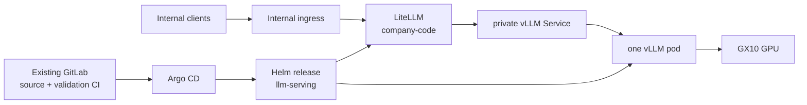

# GX10 On-Prem LLM Platform

## v0.1.0

A GitOps repository scaffold for an internal LLM service on one ASUS Ascent GX10.

```text
K3s
→ validated Kubernetes GPU resource
→ Argo CD
→ Helm release in llm-serving
→ LiteLLM
→ one private vLLM pod
→ one active model on the GX10
```

## Implemented v0.1.0 scope

- One Kubernetes namespace: `llm-serving`.
- One active vLLM base model and one GPU request: `nvidia.com/gpu: 1`.
- One stable internal endpoint and model alias: `company-code`.
- One LiteLLM gateway credential for a small trusted internal pilot.
- Helm as the application definition and Argo CD as the only application deployer.
- Existing on-prem GitLab for source control and validation-only CI.
- Git-based model replacement and rollback using the Kubernetes `Recreate` strategy.

## Deliberately not implemented in v0.1.0

- Parallel production and staging models.
- GPU time-slicing, CUDA MPS, or MIG.
- Zero-downtime model swaps.
- Individual users, SSO, virtual keys, persistent usage accounting, or per-user quotas.
- GitLab jobs that deploy directly to Kubernetes.
- Container-image builds in this repository.

## GX10 and Kubernetes decision

K3s is the selected Kubernetes distribution for this single-node design.

NVIDIA GPU Operator is the first GX10 GPU integration candidate. NVIDIA's support documentation lists DGX Spark and K3s, but it also includes a separate discrete-GPU limitation and does not name ASUS GX10. Do not treat GPU Operator as confirmed GX10 support until the actual machine exposes `nvidia.com/gpu: 1` and passes an Arm64 GPU workload and small-vLLM-model test.

The application chart depends only on the standard Kubernetes GPU resource. It does not use GPU Operator custom resources.

## Architecture


```mermaid
flowchart LR
    client["Internal clients"] --> ingress["Internal ingress"]
    ingress --> gateway["LiteLLM\ncompany-code"]
    gateway --> serving["private vLLM Service"]
    serving --> pod["one vLLM pod"]
    pod --> gx10["GX10 GPU"]

    gitlab["Existing GitLab\nsource + validation CI"] --> argo["Argo CD"]
    argo --> release["Helm release\nllm-serving"]
    release --> gateway
    release --> pod
```

## Repository guardrails

The chart and validation scripts enforce these v0.1.0 invariants:

- vLLM replica count is `1`.
- vLLM deployment strategy is `Recreate`.
- GPU limit is `nvidia.com/gpu: 1`.
- `trustRemoteCode` must remain `false`.
- Model and container images are pinned by immutable references in tracked desired state.
- vLLM has no public ingress route.
- Secret and RBAC resources are excluded from the Argo CD application project.

## Before first deployment

1. Push the reviewed repository to the internal GitLab project and protected deployment branch.
2. Validate K3s and the GX10 GPU resource path.
3. Replace placeholders in `charts/llm-serving/values/gx10.yaml` with tested images, an exact model revision, benchmarked capacity settings, and the internal hostname.
4. Run `sh scripts/validate-helm.sh`.
5. Create the real `llm-serving-secrets` Secret outside Git.
6. Bootstrap the Argo CD project and application templates.
7. Verify synchronization and run `sh scripts/smoke-api.sh` from an approved internal environment.

## Model release workflow

```text
Review values/gx10.yaml
→ GitLab validates the chart and rendered manifest
→ merge approved change
→ Argo CD reconciles
→ Kubernetes stops the old vLLM pod and loads the replacement
→ run smoke test
→ retain or revert the Git commit
```

## Documents

- [Deployment runbook](docs/deployment-runbook.md)
- [Acceptance checklist](docs/acceptance-checklist.md)
- [Bootstrap runbook](docs/bootstrap.md)
- [Compatibility and upgrades](docs/compatibility-and-upgrades.md)
- [Kubernetes distribution](docs/kubernetes-distribution.md)
- [Kubernetes layout](docs/kubernetes.md)
- [GitOps v0.1.0](docs/gitops.md)
- [Secret handling](docs/secrets.md)
- [Quotas and identity scope](docs/quotas-and-identity.md)
- [Model release workflow](docs/model-release.md)
- [ADR-0001: One Active vLLM Model](docs/decisions/0001-v0.1.0-one-active-model.md)
- [ADR-0002: K3s and GX10 GPU Enablement](docs/decisions/0002-k3s-and-gpu-operator.md)
