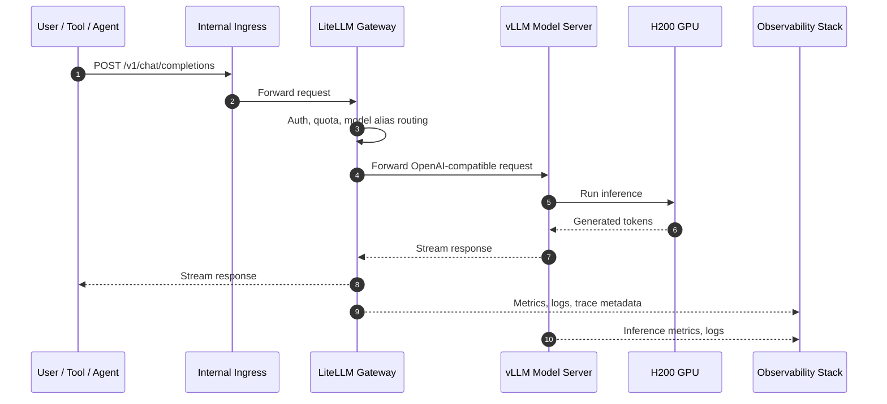
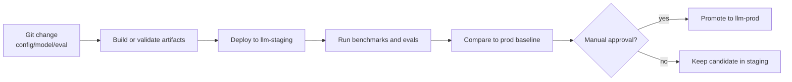

# Architecture

## Goal

Provide an internal LLM platform for chat, coding assistance, and service-to-service AI workloads using on-prem GPU capacity.

The core requirements:

- One stable internal API endpoint
- Human and non-human access
- Quotas and rate limits
- Production and staging separation
- Model benchmarking before promotion
- Observability across gateway, serving, Kubernetes, and GPU layers
- Minimal custom code in the inference path

## Main request flow



## Component responsibilities

### LiteLLM

LiteLLM is the platform gateway.

It owns:

- API surface exposed to users and tools
- Authentication integration
- API key validation
- User, team, and service identity mapping
- Request limits
- Token limits
- Model aliases
- Routing to backend model servers
- Usage accounting
- Quota rejection
- Basic request metadata

LiteLLM should be the public internal endpoint. Clients should not call vLLM directly.

### vLLM

vLLM is the model-serving backend.

It owns:

- Loading model weights
- Running inference
- Efficient batching
- Streaming tokens
- Exposing an OpenAI-compatible backend endpoint
- Model-side metrics such as queue time, latency, and token throughput

### Kubernetes

Kubernetes provides:

- Deployment control
- Namespace separation
- Service discovery
- Secret injection
- Rollouts and rollbacks
- Resource quotas
- GPU scheduling
- Benchmark Jobs and CronJobs
- Observability integration

### Jenkins

Jenkins owns the delivery and evaluation pipeline:



## Endpoint model

Expose stable endpoints:

```text
Production:
https://llm.internal.example/v1

Staging:
https://llm-staging.internal.example/v1
```

The endpoint stays stable. The model alias changes:

```text
company-fast
company-code
company-large
company-experimental
```

## Why not expose one endpoint per model?

Avoid this pattern:

```text
https://company-code.internal.example
https://company-fast.internal.example
https://company-large.internal.example
```

It creates unnecessary client coupling.

Better:

```text
https://llm.internal.example/v1
```

and select the model by alias in the request body.

## Why `/chat/completions`?

Modern chat models and agent clients usually use:

```text
/v1/chat/completions
```

Support `/v1/completions` only if legacy clients need it.

Minimum version 1 API:

- `/v1/chat/completions`
- `/v1/models`

Optional later:

- `/v1/embeddings`
- `/v1/completions`
