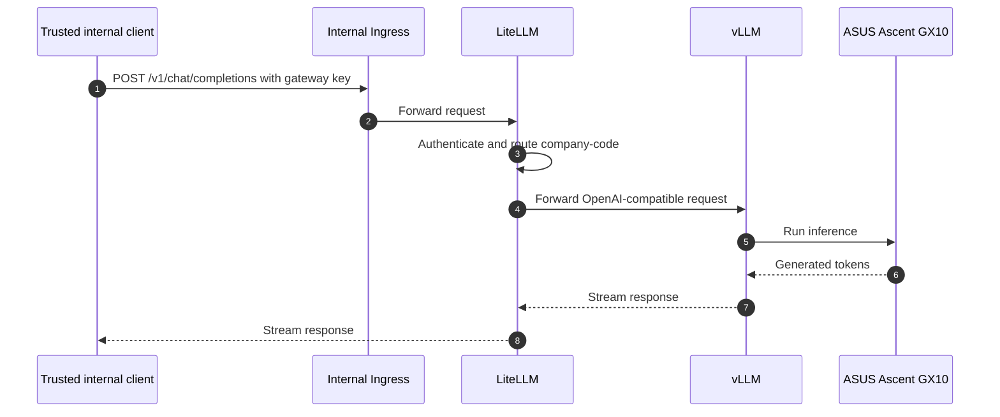
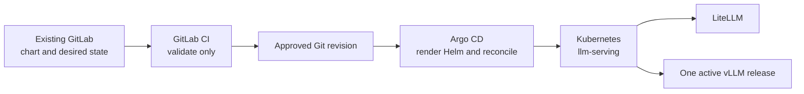

# Architecture

## v0.1.0 goal

Provide a small trusted internal LLM pilot for chat, coding assistance, and service-to-service experiments on one ASUS Ascent GX10.

The platform serves one active GPU-backed base model at a time. A model change is a GitOps release with a planned interruption while the replacement model loads.

## Implemented requirements

- One stable internal OpenAI-compatible API endpoint.
- One LiteLLM gateway credential for trusted pilot clients.
- One Kubernetes namespace: `llm-serving`.
- One GPU-backed vLLM Deployment with one active model release.
- Helm as the application definition.
- Git as the desired-state source of truth.
- Argo CD as the only application deployer.
- Existing on-prem GitLab for source control and validation-only CI.
- Basic readiness, liveness, and optional monitoring integration.

## Deferred requirements

- Individual user or service identities.
- SSO/OIDC.
- Virtual keys, per-client quotas, persistent usage, and audit accounting.
- Parallel staging model access.
- Zero-downtime model replacement.

## Main request flow


```mermaid
sequenceDiagram
    autonumber
    participant Client as Trusted internal client
    participant Ingress as Internal Ingress
    participant Gateway as LiteLLM
    participant VLLM as vLLM
    participant GX10 as ASUS Ascent GX10

    Client->>Ingress: POST /v1/chat/completions with gateway key
    Ingress->>Gateway: Forward request
    Gateway->>Gateway: Authenticate and route company-code
    Gateway->>VLLM: Forward OpenAI-compatible request
    VLLM->>GX10: Run inference
    GX10-->>VLLM: Generated tokens
    VLLM-->>Gateway: Stream response
    Gateway-->>Client: Stream response
```

## Delivery flow


```mermaid
flowchart LR
    git["Existing GitLab\nchart and desired state"] --> ci["GitLab CI\nvalidate only"]
    ci --> merge["Approved Git revision"]
    merge --> argo["Argo CD\nrender Helm and reconcile"]
    argo --> k8s["Kubernetes\nllm-serving"]
    k8s --> litellm["LiteLLM"]
    k8s --> vllm["One active vLLM release"]
```

## Component responsibilities

### LiteLLM

LiteLLM is the stable internal gateway. In v0.1.0 it enforces one master gateway key and routes the stable `company-code` alias to vLLM. Database-backed identity, quotas, virtual keys, and persistent accounting are deferred.

### vLLM

vLLM loads and serves the active model on the GX10. Helm values define the exact model revision, quantization, context limit, concurrency settings, runtime image digest, and reviewed arguments.

### Kubernetes and Helm

Kubernetes runs LiteLLM and vLLM in `llm-serving`. The Helm chart defines workloads, Services, ConfigMaps, Secret references, model-cache PVC, Ingress, NetworkPolicy for vLLM, and optional monitoring integration.

The vLLM Deployment uses `Recreate`, so Kubernetes terminates the previous GPU-serving pod before loading the replacement model.

### Argo CD

Argo CD tracks the approved Git revision, renders the Helm chart, and reconciles Kubernetes to desired state. GitLab CI does not deploy directly to Kubernetes.

### GX10 GPU integration

K3s is the selected Kubernetes distribution. NVIDIA GPU Operator is the first GPU integration candidate, but the actual GX10 must prove a stable `nvidia.com/gpu: 1` resource before the application is deployed.

## Endpoint model

```text
https://INTERNAL_HOST/v1
```

Minimum API:

- `/v1/chat/completions`
- `/v1/models`

Clients select `company-code`. A model release changes the implementation behind that stable alias without changing client configuration.

## Model replacement

```text
Change reviewed model values in Git
→ GitLab CI validates the Helm release
→ merge to the tracked branch
→ Argo CD synchronizes Kubernetes
→ the vLLM Deployment recreates with the new model
→ run the API smoke test
→ retain the commit or revert it
```
