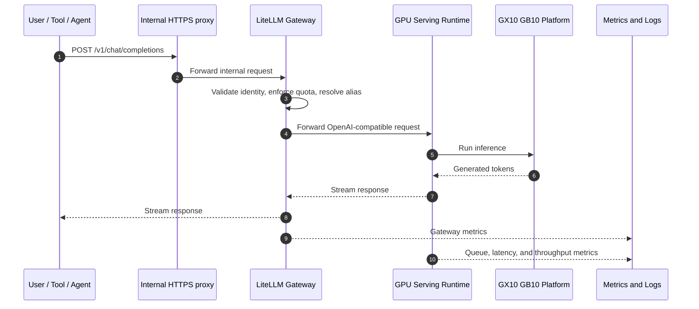

# Architecture

## Goal

Provide an internal LLM platform for chat, coding assistance, and service-to-service AI workloads on one ASUS Ascent GX10.

The design prioritizes a stable API, internal access controls, reproducible deployment, and measured use of the GX10's shared CPU and GPU memory. It does not treat one host as a highly available platform.

## Core requirements

- One stable internal OpenAI-compatible API endpoint
- Human and non-human access
- API keys, quotas, rate limits, and usage tracking
- Arm64-compatible deployment artifacts
- Controlled model testing before a model becomes a default alias
- Basic metrics and logs across the gateway, runtime, host, and GPU
- Minimal custom code in the inference path
- Self-managed GitLab for source control, registry, and CI/CD

## Main request flow


```mermaid
sequenceDiagram
    autonumber
    participant Client as User / Tool / Agent
    participant Proxy as Internal HTTPS proxy
    participant Gateway as LiteLLM Gateway
    participant Runtime as GPU Serving Runtime
    participant GX10 as GX10 GB10 Platform
    participant Obs as Metrics and Logs

    Client->>Proxy: POST /v1/chat/completions
    Proxy->>Gateway: Forward internal request
    Gateway->>Gateway: Validate identity, enforce quota, resolve alias
    Gateway->>Runtime: Forward OpenAI-compatible request
    Runtime->>GX10: Run inference
    GX10-->>Runtime: Generated tokens
    Runtime-->>Gateway: Stream response
    Gateway-->>Client: Stream response
    Gateway-->>Obs: Gateway metrics
    Runtime-->>Obs: Queue, latency, and throughput metrics
```

## Component responsibilities

### Internal HTTPS reverse proxy

The proxy provides internal TLS termination, one hostname such as `llm.internal.example`, request-size limits, and optional corporate-network or VPN allowlisting. It forwards only to LiteLLM.

The serving runtime must not be exposed directly to users, developer tools, or the network edge.

### LiteLLM

LiteLLM is the platform gateway. It owns:

- API surface exposed to users and tools
- API key validation
- User, team, and service identity mapping
- Request, token, concurrency, and model limits
- Stable model aliases
- Backend routing
- Usage accounting and quota rejection

LiteLLM should be the only service behind the proxy that accepts client requests.

### GPU serving runtime

The runtime loads model weights, runs GX10 inference, batches requests, streams output, and exports runtime metrics.

vLLM is the first candidate because it provides an OpenAI-compatible serving interface and fits behind LiteLLM. Validate Linux Arm64, driver, CUDA, model, and container support on the GX10 before treating it as the production runtime.

The gateway API and model-alias contract remain unchanged if a different compatible runtime is selected later.

### Docker Compose

Docker Compose provides reproducible service definitions, versioned images and configuration, a private application network, durable volumes, and controlled restarts.

It is appropriate for one machine. Kubernetes is not a version-1 requirement.

### Self-managed GitLab and GitLab Runner

GitLab provides source control, merge requests, container registry, CI validation, protected deployment jobs, pipeline artifacts, and manual approvals for GPU-affecting rollout or benchmark steps.

GitLab Runner performs build, validation, and deployment work. A protected runner with limited GX10 access performs deployment and GPU smoke-test jobs. See [GitLab CI/CD](gitlab-ci-cd.md).

## Stable endpoint and aliases

Expose one stable endpoint:

```text
https://llm.internal.example/v1
```

Use approved aliases:

```text
company-fast
company-code
company-large
company-candidate
```

`company-candidate` is restricted to approved tests. An alias is a client contract, not a guarantee that every named model can run concurrently on one GX10.

## API scope

Minimum version 1 API:

- `/v1/chat/completions`
- `/v1/models`

Add later only after a real client requirement:

- `/v1/embeddings`
- `/v1/completions`

## Single-host constraints

- No high availability. A host, driver, or runtime failure makes the service unavailable.
- No production-equivalent staging environment on the same host.
- Do not assume multiple large models can remain loaded concurrently.
- Shared unified memory means the model, context, batching, host processes, and GPU work compete for one memory pool.
- GPU-heavy evaluation can affect live latency. Run it in a maintenance window or after draining production traffic.
- Model compatibility, memory use, token throughput, and latency are acceptance tests, not assumptions.

## Security boundary

- Keep management access separate from the LLM API path.
- Permit API access only through the internal proxy, corporate network, or VPN.
- Keep the LiteLLM-to-runtime network private.
- Store deployment credentials outside Git.
- Do not log prompts, completions, or credentials by default.
