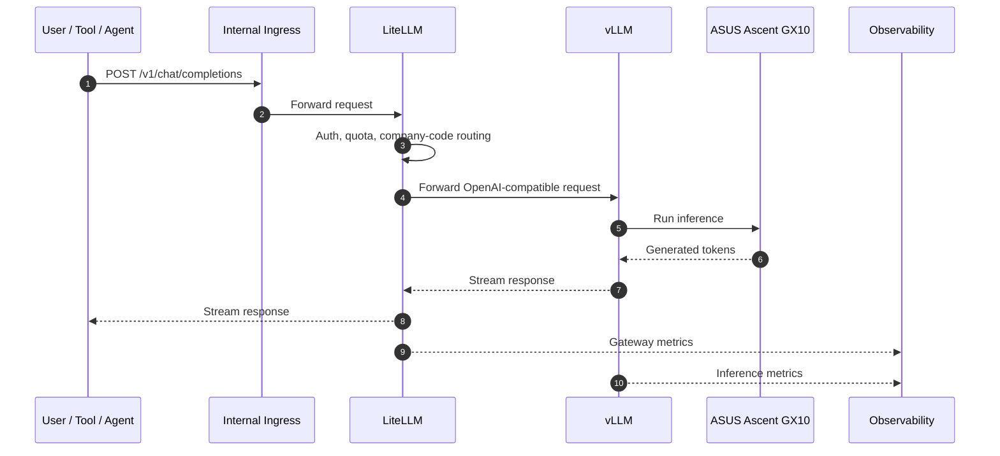
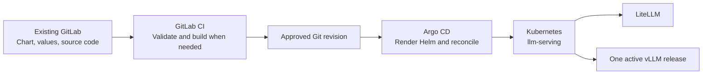

# Architecture

## v0.1.0 goal

Provide an internal LLM platform for chat, coding assistance, and service-to-service AI workloads on one ASUS Ascent GX10 with the NVIDIA GB10 Grace Blackwell platform.

The platform uses one active GPU-serving base model at a time. A model change is a GitOps release change, with a planned service interruption while the new model loads.

## Core requirements

- One stable internal OpenAI-compatible API endpoint
- Human and non-human access
- API keys, quotas, rate limits, and usage tracking
- One Kubernetes namespace: `llm-serving`
- One GPU-backed vLLM Deployment with one active model release
- Helm as the application definition
- Git as the desired-state source of truth
- Argo CD as the Kubernetes reconciler
- Existing on-prem GitLab for source control, CI, and image registry
- Basic observability across LiteLLM, vLLM, Kubernetes, and the GX10

## Main request flow


```mermaid
sequenceDiagram
    autonumber
    participant User as User / Tool / Agent
    participant Ingress as Internal Ingress
    participant Gateway as LiteLLM
    participant VLLM as vLLM
    participant GX10 as ASUS Ascent GX10
    participant Obs as Observability

    User->>Ingress: POST /v1/chat/completions
    Ingress->>Gateway: Forward request
    Gateway->>Gateway: Auth, quota, company-code routing
    Gateway->>VLLM: Forward OpenAI-compatible request
    VLLM->>GX10: Run inference
    GX10-->>VLLM: Generated tokens
    VLLM-->>Gateway: Stream response
    Gateway-->>User: Stream response
    Gateway-->>Obs: Gateway metrics
    VLLM-->>Obs: Inference metrics
```

## Delivery flow


```mermaid
flowchart LR
    git["Existing GitLab\nChart, values, source code"] --> ci["GitLab CI\nValidate and build when needed"]
    ci --> merge["Approved Git revision"]
    merge --> argo["Argo CD\nRender Helm and reconcile"]
    argo --> k8s["Kubernetes\nllm-serving"]
    k8s --> litellm["LiteLLM"]
    k8s --> vllm["One active vLLM release"]
```

## Component responsibilities

### LiteLLM

LiteLLM is the stable public internal gateway. It provides API keys, identity mapping, quotas, usage accounting, and a stable `company-code` model alias.

### vLLM

vLLM loads and serves the active model release on the GX10. The Helm values define the exact model, revision, quantization, context limit, concurrency settings, runtime image, and reviewed additional arguments.

### Kubernetes and Helm

Kubernetes runs LiteLLM and vLLM in `llm-serving`. The Helm chart defines the workload, Service, ConfigMaps, Secret references, model-cache PVC reference, Ingress, NetworkPolicy, and monitoring integration.

The vLLM Deployment uses `Recreate`, so Kubernetes terminates the previous GPU-serving pod before loading the replacement model.

### Argo CD

Argo CD tracks the approved Git revision, renders the Helm chart, and reconciles Kubernetes to the desired state.

### Existing GitLab

GitLab hosts the source and desired state. GitLab CI validates Helm changes and builds immutable images only when custom deployment code changes. It does not apply the application to Kubernetes directly.

## Endpoint model

```text
https://llm.internal.example/v1
```

Minimum API:

- `/v1/chat/completions`
- `/v1/models`

Clients select `company-code`. A model release changes the implementation behind that stable alias, rather than changing client configuration.

## Model replacement

```text
Change reviewed model values in Git
→ GitLab CI validates the Helm release
→ merge to the tracked branch
→ Argo CD synchronizes Kubernetes
→ the vLLM Deployment recreates with the new model
→ retain the commit or revert it
```

The system does not require a parallel always-on staging model for v0.1.0.