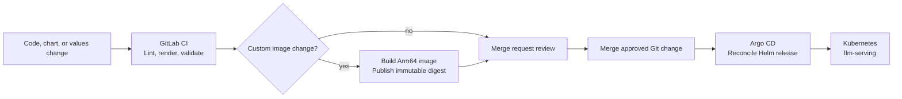

# GitLab CI/CD

## Role in v0.1.0

The existing on-prem GitLab provides source control, merge requests, CI, and the container registry.

Argo CD provides continuous delivery. GitLab CI does not directly run Helm deployments against Kubernetes.

## GitLab CI responsibilities

For Helm chart and values changes, GitLab CI:

- Runs `helm lint`.
- Renders the GX10 release with `helm template`.
- Validates the rendered Kubernetes manifests.
- Runs chart schema and policy checks.
- Reports the result on the merge request.

For custom deployment-code changes, GitLab CI additionally:

- Builds an Arm64-compatible image.
- Publishes the image to the existing GitLab Container Registry.
- Uses an immutable image digest for the release.
- Updates the image digest through a reviewed Git change.

The merge to the tracked branch is the deployment approval. Argo CD detects the desired-state change and applies it.

## Pipeline shape

## Model changes

A model replacement normally changes the GX10 Helm values file. It does not require a custom image build unless the new model needs a different tested vLLM image.

The values change includes the exact model revision, quantization, context limit, concurrency settings, runtime image digest, and any reviewed vLLM flags.

## No direct deployment credentials

The v0.1.0 GitLab pipeline does not need application-deployment credentials for the Kubernetes cluster. Argo CD holds the reconciliation responsibility and reads the approved Git revision.

## Release records

Git history records the intended deployment state. GitLab CI records validation and image-build results. Argo CD records the applied revision and live synchronization state.

A rollback is a revert of the desired-state commit, followed by Argo CD reconciliation.
