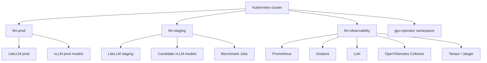
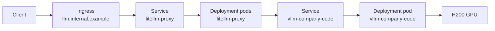

# Kubernetes Layout

## Namespaces



Recommended namespaces:

```text
llm-prod
llm-staging
llm-observability
```

The NVIDIA GPU Operator may use its own namespace, depending on installation style.

## Kubernetes objects

### Production

Use:

- `Deployment`: LiteLLM
- `Service`: LiteLLM
- `Ingress`: internal route, for example `llm.internal.example`
- `ConfigMap`: LiteLLM model routing config
- `Secret`: credentials and service keys
- `Deployment`: each vLLM model server
- `Service`: each vLLM model server
- `PVC`: model storage, if models are stored locally
- `NetworkPolicy`: only LiteLLM can call vLLM
- `ResourceQuota`: prevent accidental namespace overuse
- `ServiceAccount`, `Role`, `RoleBinding`: scoped permissions

### Staging

Use:

- `Deployment`: LiteLLM staging
- `Service`: LiteLLM staging
- `Ingress`: `llm-staging.internal.example`
- `Deployment`: candidate vLLM model server
- `Service`: candidate vLLM model server
- `Job`: one-off benchmark run
- `CronJob`: scheduled regression benchmark
- `Secret`: staging-only API keys
- `NetworkPolicy`: keep staging isolated from production

### Observability

Use:

- `Prometheus`
- `Grafana`
- `Loki`
- `Grafana Alloy` or `Promtail`
- `OpenTelemetry Collector`
- `Tempo` or `Jaeger`
- `kube-state-metrics`
- `node-exporter`
- `DCGM Exporter`

## Deployment vs StatefulSet

Use `Deployment` for LiteLLM.

Use `Deployment` for vLLM in version 1.

A `StatefulSet` is only needed if:

- Each replica needs stable identity
- Each pod owns separate persistent storage
- You run a more complex distributed serving setup
- Stable pod-to-storage mapping matters

For a first version on one H200 server, `Deployment` is simpler and sufficient.

## GPU scheduling

A vLLM pod requests the GPU with:

```yaml
resources:
  limits:
    nvidia.com/gpu: 1
```

The NVIDIA GPU Operator and device plugin make that resource available to Kubernetes.

## Internal service routing



Internal vLLM service name example:

```text
http://vllm-company-code.llm-prod.svc.cluster.local:8000/v1
```

Clients should call:

```text
https://llm.internal.example/v1/chat/completions
```

not the vLLM service directly.
