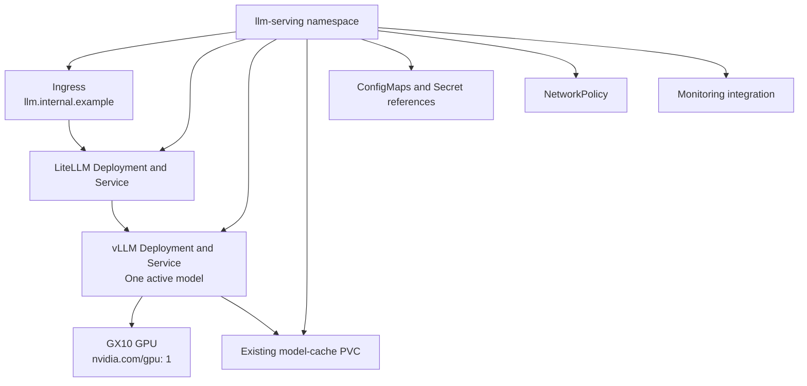
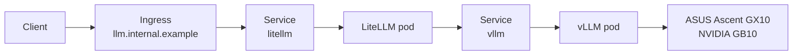

# Kubernetes Layout

## v0.1.0 namespace

Use one namespace:

```text
llm-serving
```

The namespace contains the application release for one GX10 and one active model. The NVIDIA GPU Operator, Argo CD, ingress controller, and cluster-level monitoring are platform prerequisites outside this application namespace.

## Application objects


```mermaid
flowchart TB
    ns["llm-serving namespace"] --> ingress["Ingress\nllm.internal.example"]
    ns --> litellm["LiteLLM Deployment and Service"]
    ns --> vllm["vLLM Deployment and Service\nOne active model"]
    ns --> cache["Existing model-cache PVC"]
    ns --> config["ConfigMaps and Secret references"]
    ns --> policy["NetworkPolicy"]
    ns --> monitor["Monitoring integration"]

    ingress --> litellm
    litellm --> vllm
    vllm --> gx10["GX10 GPU\nnvidia.com/gpu: 1"]
    vllm --> cache
```

The Helm chart renders:

- LiteLLM `Deployment` and `Service`
- vLLM `Deployment` and private `Service`
- internal `Ingress`
- LiteLLM and vLLM `ConfigMaps`
- references to pre-created secrets
- model-cache `PersistentVolumeClaim` reference
- `NetworkPolicy`
- `ServiceAccount`, `Role`, and `RoleBinding` where needed
- resource requests and limits
- monitoring annotations or `ServiceMonitor` when available

## GPU scheduling

The vLLM Deployment requests the full GX10 GPU:

```yaml
resources:
  limits:
    nvidia.com/gpu: 1
```

The deployment has one replica. Version 0.1.0 has one active GPU-serving model release.

## Deployment strategy

Use:

```yaml
strategy:
  type: Recreate
```

A model replacement stops the current vLLM pod before Kubernetes starts the new pod. This keeps the GX10 dedicated to one model load during the transition.

## Internal service routing


```mermaid
flowchart LR
    client["Client"] --> ingress["Ingress\nllm.internal.example"]
    ingress --> litellmSvc["Service\nlitellm"]
    litellmSvc --> litellmPod["LiteLLM pod"]
    litellmPod --> vllmSvc["Service\nvllm"]
    vllmSvc --> vllmPod["vLLM pod"]
    vllmPod --> gx10["ASUS Ascent GX10\nNVIDIA GB10"]
```

Clients call:

```text
https://llm.internal.example/v1/chat/completions
```

Only LiteLLM calls the private vLLM Service. The vLLM Service has no external ingress route.

## Model cache

The model cache persists outside the vLLM pod so a redeploy does not require a fresh model download. The chart refers to the existing PVC and mounts it at the vLLM download directory.

The persistent cache does not make a model release active. The active release remains the model definition committed in the Helm values.

## GitOps ownership

Argo CD owns the resources rendered by the Helm chart. Manual changes in the namespace are temporary drift and are reconciled back to the Git-defined state.
