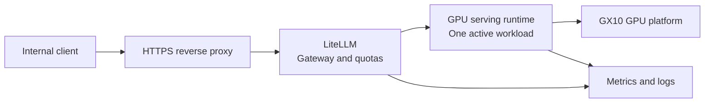

# Single-Host Deployment

This file keeps its historical path, but the version-1 design does **not** use Kubernetes. It defines the GX10 deployment shape instead.

## Host model

Run the platform on one ASUS Ascent GX10 using Linux on Arm64, Docker Engine, and Docker Compose.

Validate the selected serving runtime, container image, NVIDIA container integration, driver stack, and model architecture on the GX10 before enabling internal users.

## Services


```mermaid
flowchart LR
    client["Internal client"] --> proxy["HTTPS reverse proxy"]
    proxy --> litellm["LiteLLM\nGateway and quotas"]
    litellm --> runtime["GPU serving runtime\nOne active workload"]
    runtime --> gx10["GX10 GPU platform"]
    litellm --> telemetry["Metrics and logs"]
    runtime --> telemetry
```

| Service | Version 1 | Purpose |
|---|---:|---|
| Reverse proxy | Required | TLS and internal access boundary |
| LiteLLM | Required | Stable API, aliases, limits, and usage |
| GPU serving runtime | Required | Model loading and inference |
| Prometheus and Grafana | Optional | Health and performance dashboards |
| Loki and Alloy | Optional | Centralized logs |

The serving runtime uses a private Compose network and must not publish a host port. Only the reverse proxy accepts client traffic.

## Persistent host layout

```text
/srv/llm/
  compose.yaml
  env/production.env
  config/
  data/models/
  data/runtime-cache/
  data/litellm/
  logs/
```

Keep secrets, model weights, certificates, and production environment files out of Git.

## Capacity rules

The GX10 uses unified memory. The operating system, CPU workloads, GPU workloads, model weights, context cache, and batching compete for one pool.

- Start with one active serving model.
- Set context and concurrency limits from a benchmark.
- Treat any second loaded model as an explicit capacity decision.
- Run GPU-heavy benchmarks in a maintenance window or after draining normal traffic.
- Remove unused model revisions and container images because the 1 TB NVMe disk can fill quickly.

## Candidate testing

There is no production-equivalent staging environment on one host. Use one controlled approach:

1. Drain or pause normal traffic, run a candidate test, then restore production.
2. Expose a restricted `company-candidate` alias only when measured capacity allows it.
3. Run an offline benchmark without a public gateway route.

The first approach is the safest default.

## Networking and recovery

- Use a stable internal DNS name or reserved DHCP address.
- Keep management access restricted to administrators through the corporate network or VPN.
- Do not expose the API, the LiteLLM administration surface, or the serving runtime to the public internet.
- Back up durable configuration and service state.
- A host, driver, storage, or runtime failure is an outage until the single host is restored.
