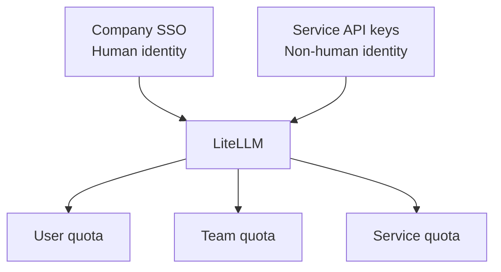
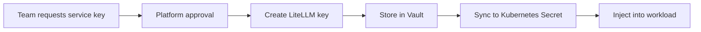

# Quotas and Identity

## Request vs token

A request is one API call.

A token is a chunk of input or output text processed by the model.

Example:

```text
One API call with:
- 8,000 input tokens
- 1,000 output tokens

Result:
- 1 request
- 9,000 total tokens
```

Request limits and token limits protect different things.

| Limit type | Protects against |
|---|---|
| Requests per minute | Too many calls, API overload, noisy clients |
| Tokens per minute | Heavy prompts, long generations, GPU pressure |
| Tokens per day/month | Budget exhaustion and unfair usage |
| Concurrent requests | Agent loops and overloaded model servers |
| Max context size | Huge prompts that hurt latency and memory |
| Max output tokens | Long uncontrolled generations |

## Every identity needs limits

Do not limit only human users.

Limit:

- Human users
- Teams
- Service accounts
- Coding agents
- Jenkins jobs
- Bots
- Backend services

Coding agents and CI jobs often need larger budgets than humans, but stricter guardrails.

Example:

```text
Human user:
  60 requests/minute
  200K tokens/day

Coding agent:
  10 concurrent runs
  2M tokens/day
  max 100K tokens per task
  stop after N failed attempts

Jenkins benchmark:
  staging only
  fixed benchmark budget
  no production model access
```

## Why use API keys if SSO already exists?

Use both.



Human users should authenticate through SSO when possible.

Non-human workloads need service identities:

- Jenkins jobs
- Coding agents
- Slack/Teams bots
- Internal backend services
- Scheduled summarization jobs
- Benchmark runners

Do not run these under a random engineer's personal account.

## Service key ownership

Each service API key should have:

- Owning team
- Owning person or group
- Environment: production or staging
- Allowed model aliases
- Token budget
- Request limits
- Concurrency limits
- Expiration or rotation policy
- Audit trail

Example:

```text
Key name:
engineering-coding-agent-prod

Owner:
Engineering Productivity

Environment:
production

Allowed models:
company-code, company-fast

Denied models:
company-experimental

Budget:
5M tokens/day

Rotation:
90 days
```

## Where keys live

Keys should not be committed to Git.

Recommended storage:

- HashiCorp Vault
- Kubernetes Secrets, ideally synced from external secret management
- External Secrets Operator
- Sealed Secrets
- Jenkins credentials for Jenkins-only keys

For on-prem environments, a practical setup is:

```text
Vault
  -> External Secrets Operator
  -> Kubernetes Secret
  -> Pod environment variable or mounted secret
```

## Who creates keys?

The platform team owns key creation and policy.

Team owners request keys for specific services.

A simple process:



A mature process can use an internal portal, but the first version can use a ticket-based process.
